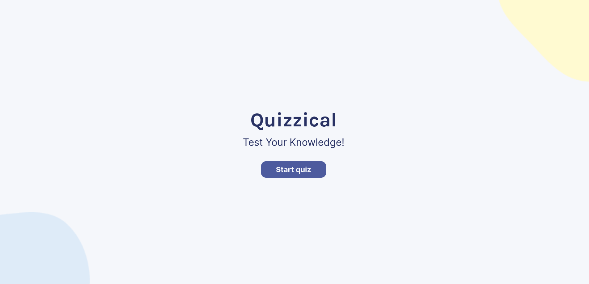
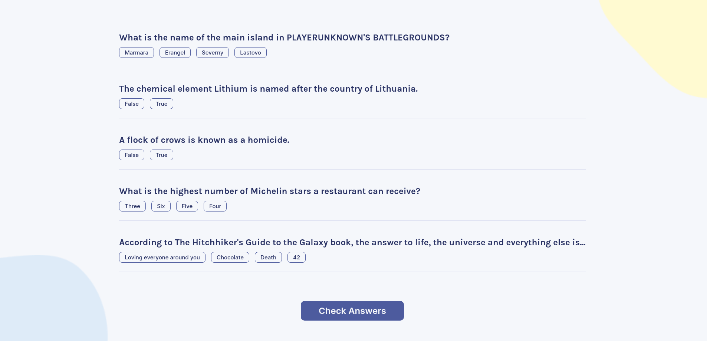
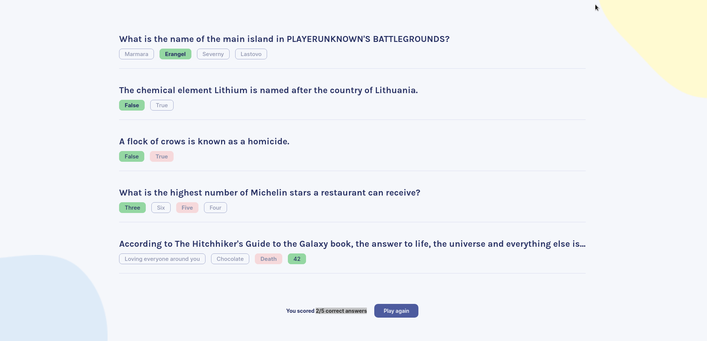

# Quizzical App 📌 

Quizzical is a simple quiz app that lets you select alternatives and then gives you a score. 
It's built with functional React components. There are lots of questions from every subject with lots of amazing answers. 


### Start from **_Start quiz_** and test your knowledge! ✒️




### What would be the answers? 📝



+ #### The 2/5 answers were correct
  


## Before you Begin 🛠 🔨
Write following command in your terminal

```
$ npm install
$ npm run dev
```

```
$ pnpm install
$ pnpm run dev
```


## For cloning the project 🪛

```
# Clone this repository
$ gh repo clone MastooraTurkmen/Quizzical-app

# Go inside the repository
$ cd quizzical-app
```


------

# React + Vite

This template provides a minimal setup to get React working in Vite with HMR and some ESLint rules.

Currently, two official plugins are available:

- [@vitejs/plugin-react](https://github.com/vitejs/vite-plugin-react/blob/main/packages/plugin-react/README.md) uses [Babel](https://babeljs.io/) for Fast Refresh
- [@vitejs/plugin-react-swc](https://github.com/vitejs/vite-plugin-react-swc) uses [SWC](https://swc.rs/) for Fast Refresh

------


## Author 👩🏻‍💻 
+ **Mastoora Turkmen**  [LinkedIn](https://www.linkedin.com/in/mastoora-turkmen/) [Github](https://github.com/MastooraTurkmen/) 
[Twitter](https://twitter.com/MastooraJ22)